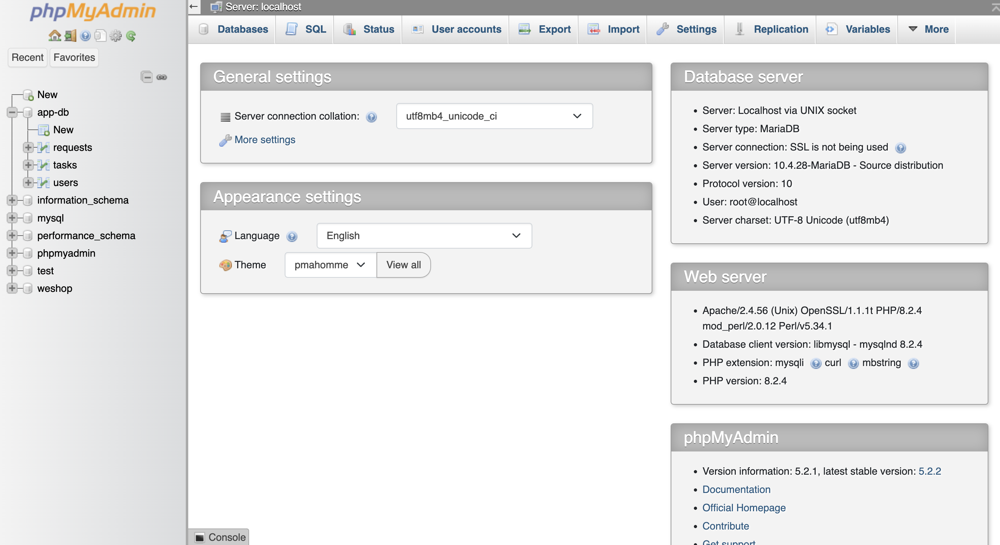
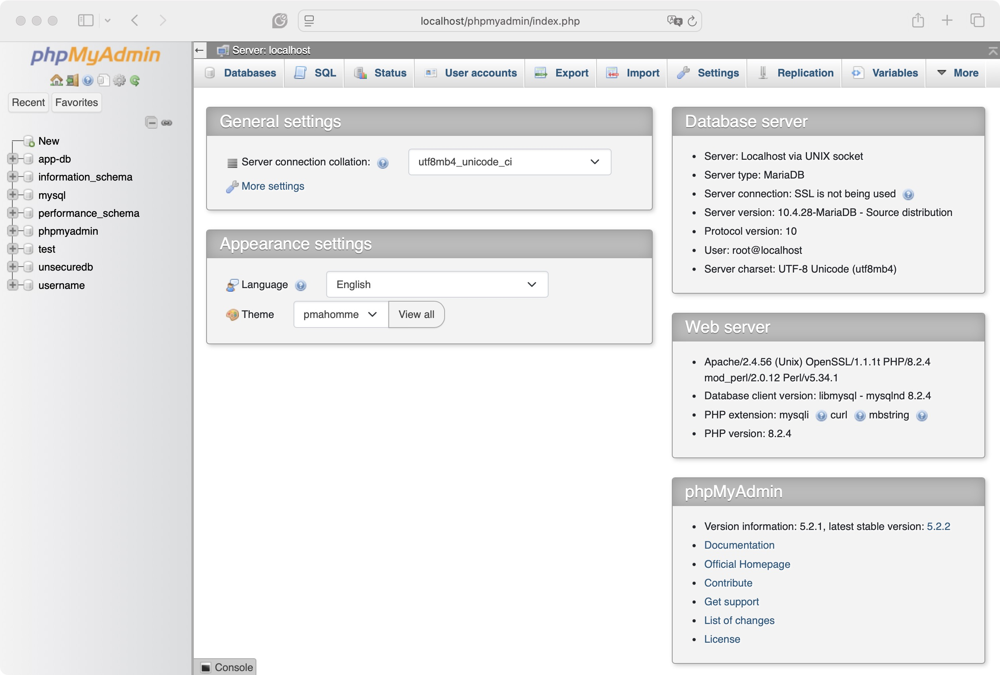
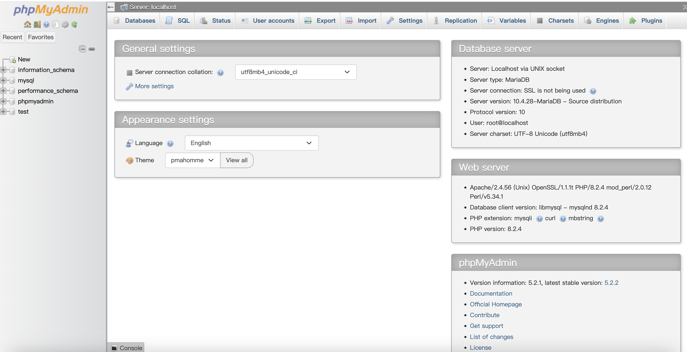
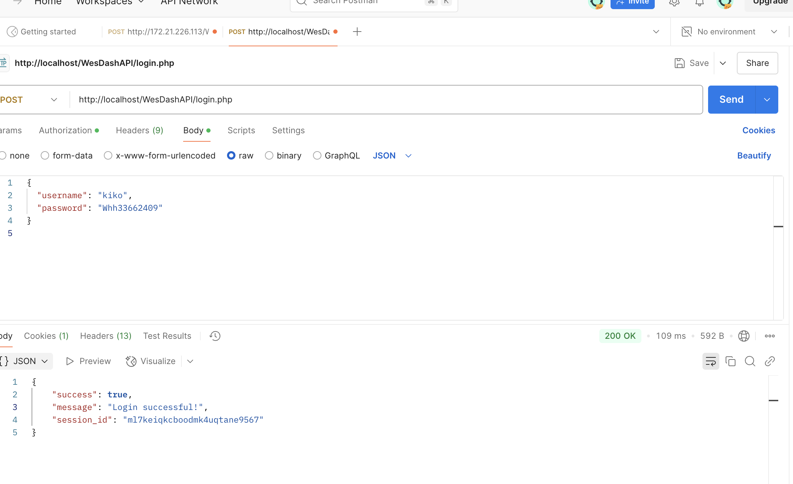
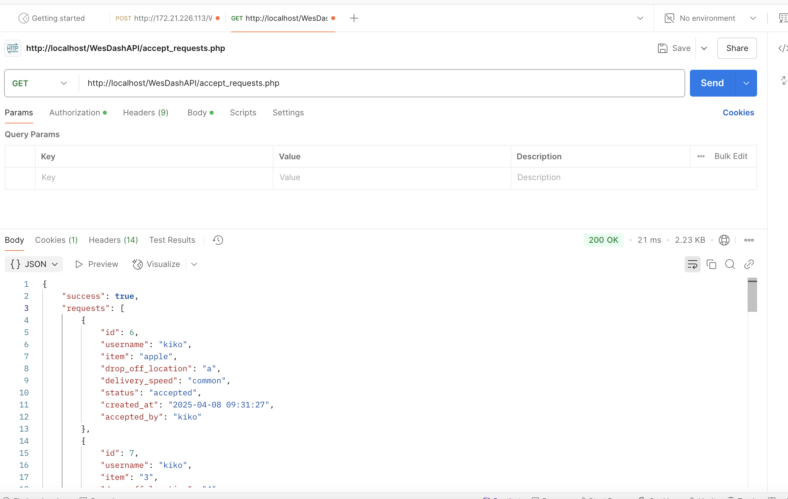
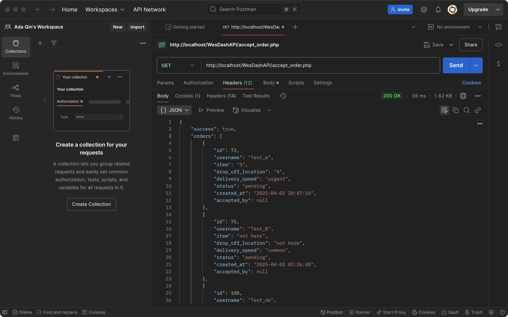
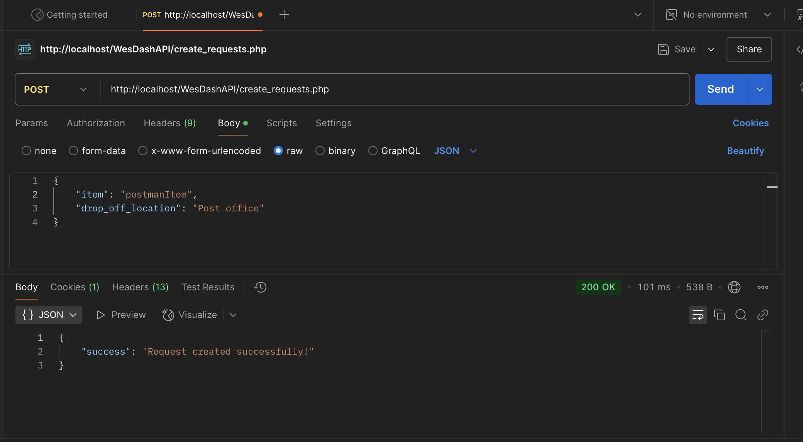
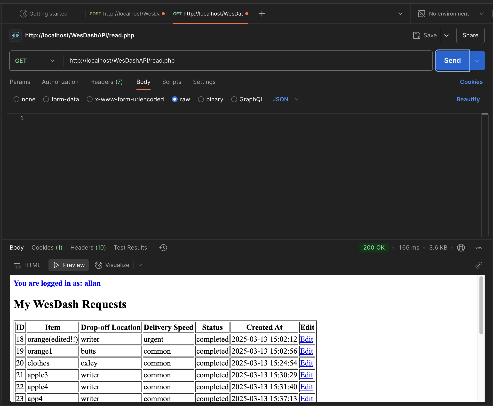

# COMP333
This is for a homework assignment for Wesleyan University, COMP333 Software Engineering.
# Introduction
This is for the first assignment of Wesleyan University, COMP333 Software Engineering.
The website is the landing page of a fictional app: WesDash.

# Teammate and work distribution
Ada Qin: Navigation bar/ Our Strength and Technology/Hyperlink(4)/Style adjustment/Log in 
Haihan Wang: Hero section/ How it works/Style adjustment
Cheruiyot Allan: Customer Reviews/Style adjustment

# Purpose of code
The Code's purpose is to create a landing page for a functional app: WesDash. WesDash is a campus delivery service built for students that is designed to provide fast and easy shopping and delivery services on a university campus. 

# Brief overview
The current repository contains the main page to introduce how WesDash works, including the content of How does app works, the login section, the strength and technology in the app, and the reviews from users, decorated with a hero section, slogan, etc.

The important files are:

index.html: The homepage of the WesDash website. This page contains key features like the navigation bar, hero section, "How It Works", advert slogans, signup form, and customer reviews.

contract.html: A page displaying the contract and terms of service for users of WesDash, including the responsibilities of Buyers, Shoppers, and all Users.

Price_list.html: A page displaying the charging of using the app, including the detailed price and description of different service

styles.css: The main stylesheet used for styling both the main page and contract page, containing a responsive design, color scheme, and layout definitions.

# How to run code

## Locally:
1. Do the following things in the terminal:
   1. `git clone https://github.com/AdaTsanQin/COMP333.git`
   2. `cd COMP333`
2. Do the following things outside of the terminal:
   3. Open the `COMP333` folder and click `index.html` to see the page.

## In the browser:
1. Put this URL in your browser: [https://adatsanqin.github.io/COMP333/](https://adatsanqin.github.io/COMP333/)

# Notification by Ada Qin
Mistakes and actions made while using Github:
1. merge styles.css, login.html, and login_confirm.html into the main branch without a pull request.
2. Part of feature/issue-27 has been changed under HaihanWang's account. The command d50efda bbdead5 d5e961d 74f5128 58f95ee bb2a1a8 is changed by Ada Qin under account 2274006014
3. Because Python as the language was selected when the repo was created at the beginning, redundant files appeared. A line ".ds_store "was added to.gitignore and manually deleted. DS_Store file


## Screenshot of Allan's Xampp


## how to run Allan's user review files - create_review.php, update_review.php delete_review.php
1. Change line 80 in dashboard.html from 
`<a href="update.php">Update Order</a>` to 
`<a href="update_task.php">Update Order</a>`

2. Now run the following SQL queries: `
CREATE TABLE tasks(task_id INT(11) NOT NULL AUTO_INCREMENT,request_id INT(11) DEFAULT NULL,username VARCHAR(255) DEFAULT ' ',dashername VARCHAR(255) DEFAULT ' ',item TEXT,status VARCHAR(50) DEFAULT ' ', rating INT(11) DEFAULT 0,comment TEXT DEFAULT ' ', PRIMARY KEY (task_id) );
`
3. Make a purchase request from the dashboard
4. Go to the dashboard and click "Claim order"
5. In the same dashboard, click "Drop off"
6. Now click "Manage reviews" tab on the top of the dashboard page
7. You should be able to see the order and Add, Update and Delete buttons. These add, update and delete reviews to orders that have been completed

NOTE: The order must have a 'complete' status before adding a review. For this to happen, you must use 'Drop Off' button from the Dashboard.


## Assignment-2
People who register the program can log in and out of the program repeatedly.
As a Buyer, the user can request someone to run errands for him: create a new order, fill in the detailed product name and address in the order, and always check whether someone has accepted the order and whether it has been delivered. There will be a prompt when the order is delivered. After confirming the items, the Buyer ends the order.
At the same time, as a Runner, you can also view the currently accepted orders, accept the orders, and send them to the Buyer at a certain time.
# Work distrubution
Ada: register/ request of Buyer / request of Runner / Readme / deployment in infinityfree
Haihan: login.php, create.php, read.php, updata.php(some part)
Allan: create,update,delete reviews/ Dashboard page
# How to set up app
1. in local MySQL, create a database called app-db
2. Do following in this URL 
http://localhost/phpmyadmin/index.php
Click on database in navigation bar
Under create database enter app-db in the "Database name"
click to get into app-db
go to SQL in navigationbar, copy the following code into it and click go:

CREATE TABLE users (
    username VARCHAR(255) NOT NULL,
    password VARCHAR(255) DEFAULT NULL,
    is_deleted TINYINT(1) DEFAULT 0,
    PRIMARY KEY (username)
);

CREATE TABLE requests (
    id INT AUTO_INCREMENT PRIMARY KEY,
    username VARCHAR(255) NOT NULL,
    item VARCHAR(255) NOT NULL,
    drop_off_location VARCHAR(255) NOT NULL,
    delivery_speed ENUM('urgent', 'common') DEFAULT 'common',
    status ENUM('pending', 'accepted', 'completed', 'confirmed') NOT NULL DEFAULT 'pending',
    created_at DATETIME NOT NULL,
    accepted_by VARCHAR(255) DEFAULT NULL,

    CONSTRAINT fk_requests_username
      FOREIGN KEY (username)
      REFERENCES users(username)
      ON UPDATE CASCADE
      ON DELETE RESTRICT
);

4. Go to the URL : http://localhost/register.php 
then test the code

# URL(infinityfree)
ada-qin.ct.ws not done but tried to set up the SSL
Having following :
Installed SSL Status
This is the SSL certificate that's installed on your hosting account.

Status	
Issuer	Google Trust Services
Expires at	2025-06-05


# local enviornment
1.Ada:


# screenshot
Haihan Wang: 


# HOMEWORK 3

## Overview
This repository contains both a React Native frontend (for iOS/Android) and a PHP/MySQL backend. The app supports:
Account Management: Create user accounts, log in, log out, delete accounts/Requests Management (CRUD): Create, read, edit (update), and delete requests/ Order Flow: Accept order, drop off order, and confirm status changes

We have also partially tested deployment via InfinityFree hosting (see InfinityFree below). The following sections explain how to set up the project locally, how the database is structured, and how to run the code.

## Project structure
WesDash/ <br>
├── .expo/ <br>
├── .idea/ <br>
├── assets/  <br>
├── node_modules/ <br>
├── screen/ <br>
│&nbsp;&nbsp;&nbsp;&nbsp;&nbsp;&nbsp;&nbsp;&nbsp;&nbsp;&nbsp;&nbsp;&nbsp;&nbsp;├── AcceptOrderScreen.js <br>
│&nbsp;&nbsp;&nbsp;&nbsp;&nbsp;&nbsp;&nbsp;&nbsp;&nbsp;&nbsp;&nbsp;&nbsp;&nbsp;├── CreateRequestScreen.js <br>
│&nbsp;&nbsp;&nbsp;&nbsp;&nbsp;&nbsp;&nbsp;&nbsp;&nbsp;&nbsp;&nbsp;&nbsp;&nbsp;├── DashboardScreen.js <br>
│&nbsp;&nbsp;&nbsp;&nbsp;&nbsp;&nbsp;&nbsp;&nbsp;&nbsp;&nbsp;&nbsp;&nbsp;&nbsp;├── HomeScreen.js <br>
│&nbsp;&nbsp;&nbsp;&nbsp;&nbsp;&nbsp;&nbsp;&nbsp;&nbsp;&nbsp;&nbsp;&nbsp;&nbsp;├── LoginScreen.js <br>
│&nbsp;&nbsp;&nbsp;&nbsp;&nbsp;&nbsp;&nbsp;&nbsp;&nbsp;&nbsp;&nbsp;&nbsp;&nbsp;├── RegisterScreen.js <br>
│&nbsp;&nbsp;&nbsp;&nbsp;&nbsp;&nbsp;&nbsp;&nbsp;&nbsp;&nbsp;&nbsp;&nbsp;&nbsp;├── ViewRequestScreen.js <br>
├── App.js <br>
├── package.json <br>
.<br>
.<br>
.<br>
Note: the project run by opening the main branch file in Android Studio

Applications/XAMPP/xamppfiles/htdocs/ <br>
├── WesDashAPI/ <br>
│&nbsp;&nbsp;&nbsp;&nbsp;&nbsp;&nbsp;&nbsp;&nbsp;&nbsp;&nbsp;&nbsp;&nbsp;&nbsp;├── accpte_order.php  <br>
│&nbsp;&nbsp;&nbsp;&nbsp;&nbsp;&nbsp;&nbsp;&nbsp;&nbsp;&nbsp;&nbsp;&nbsp;&nbsp;├── accpte_requests.php <br>
│&nbsp;&nbsp;&nbsp;&nbsp;&nbsp;&nbsp;&nbsp;&nbsp;&nbsp;&nbsp;&nbsp;&nbsp;&nbsp;├── create_requests.php <br>
│&nbsp;&nbsp;&nbsp;&nbsp;&nbsp;&nbsp;&nbsp;&nbsp;&nbsp;&nbsp;&nbsp;&nbsp;&nbsp;├── edit.php <br>
│&nbsp;&nbsp;&nbsp;&nbsp;&nbsp;&nbsp;&nbsp;&nbsp;&nbsp;&nbsp;&nbsp;&nbsp;&nbsp;├── login.php <br>
│&nbsp;&nbsp;&nbsp;&nbsp;&nbsp;&nbsp;&nbsp;&nbsp;&nbsp;&nbsp;&nbsp;&nbsp;&nbsp;├── register.php <br>
│&nbsp;&nbsp;&nbsp;&nbsp;&nbsp;&nbsp;&nbsp;&nbsp;&nbsp;&nbsp;&nbsp;&nbsp;&nbsp;├── delete_user.php <br>

Note: downlaod all the files in main that are in WesDashAPI, create a WesDashAPI under htcods folder, and put all the files downloaded from WesDashPAI folder in main.

## How to Set Up the App
A. Database & PHP (Backend)
1. Start MySQL (XAMPP, MAMP, etc.).
2. Open http://localhost/phpmyadmin/
3. Create a database, e.g., app-db.
Run the following SQL：
CREATE TABLE users (
    username VARCHAR(255) NOT NULL,
    password VARCHAR(255) DEFAULT NULL,
    is_deleted TINYINT(1) DEFAULT 0,
    PRIMARY KEY (username)
);

CREATE TABLE requests (
    id INT AUTO_INCREMENT PRIMARY KEY,
    username VARCHAR(255) NOT NULL,
    item VARCHAR(255) NOT NULL,
    drop_off_location VARCHAR(255) NOT NULL,
    delivery_speed ENUM('urgent', 'common') DEFAULT 'common',
    status ENUM('pending', 'accepted', 'completed', 'confirmed') NOT NULL DEFAULT 'pending',
    created_at DATETIME NOT NULL,
    accepted_by VARCHAR(255) DEFAULT NULL,

    CONSTRAINT fk_requests_username
      FOREIGN KEY (username)
      REFERENCES users(username)
      ON UPDATE CASCADE
      ON DELETE RESTRICT
);

Create table `tasks`:

`CREATE TABLE tasks(task_id INT(11) NOT NULL AUTO_INCREMENT,request_id INT(11) DEFAULT NULL,username VARCHAR(255) DEFAULT ' ',dashername VARCHAR(255) DEFAULT ' ',item TEXT,status VARCHAR(50) DEFAULT ' ', rating INT(11) DEFAULT 0,comment TEXT DEFAULT ' ', PRIMARY KEY (task_id) );`

B.Frontend / React Native

there are two ways to run the project:

1.
Navigate into the main branch folder.

rm -rf node_modules package-lock.json

npm install

npx expo start

a

2.
You can create a folder named WesDash and consider it as the frontend folder.

Configure the WesDash folder according to the strcutre below. All necessary files can be found in the main branch.

## Project structure
WesDash/ <br>
├── .expo/ <br>
├── .idea/ <br>
├── assets/  <br>
├── node_modules/ <br>
├── screen/ <br>
│&nbsp;&nbsp;&nbsp;&nbsp;&nbsp;&nbsp;&nbsp;&nbsp;&nbsp;&nbsp;&nbsp;&nbsp;&nbsp;├── AcceptOrderScreen.js <br>
│&nbsp;&nbsp;&nbsp;&nbsp;&nbsp;&nbsp;&nbsp;&nbsp;&nbsp;&nbsp;&nbsp;&nbsp;&nbsp;├── CreateRequestScreen.js <br>
│&nbsp;&nbsp;&nbsp;&nbsp;&nbsp;&nbsp;&nbsp;&nbsp;&nbsp;&nbsp;&nbsp;&nbsp;&nbsp;├── DashboardScreen.js <br>
│&nbsp;&nbsp;&nbsp;&nbsp;&nbsp;&nbsp;&nbsp;&nbsp;&nbsp;&nbsp;&nbsp;&nbsp;&nbsp;├── HomeScreen.js <br>
│&nbsp;&nbsp;&nbsp;&nbsp;&nbsp;&nbsp;&nbsp;&nbsp;&nbsp;&nbsp;&nbsp;&nbsp;&nbsp;├── LoginScreen.js <br>
│&nbsp;&nbsp;&nbsp;&nbsp;&nbsp;&nbsp;&nbsp;&nbsp;&nbsp;&nbsp;&nbsp;&nbsp;&nbsp;├── RegisterScreen.js <br>
│&nbsp;&nbsp;&nbsp;&nbsp;&nbsp;&nbsp;&nbsp;&nbsp;&nbsp;&nbsp;&nbsp;&nbsp;&nbsp;├── ViewRequestScreen.js <br>
├── App.js <br>
├── package.json <br>
.<br>
.<br>
.<br>
Note: the project run by opening the main branch file in Android Studio

Applications/XAMPP/xamppfiles/htdocs/ <br>
├── WesDashAPI/ <br>
│&nbsp;&nbsp;&nbsp;&nbsp;&nbsp;&nbsp;&nbsp;&nbsp;&nbsp;&nbsp;&nbsp;&nbsp;&nbsp;├── accpte_order.php  <br>
│&nbsp;&nbsp;&nbsp;&nbsp;&nbsp;&nbsp;&nbsp;&nbsp;&nbsp;&nbsp;&nbsp;&nbsp;&nbsp;├── accpte_requests.php <br>
│&nbsp;&nbsp;&nbsp;&nbsp;&nbsp;&nbsp;&nbsp;&nbsp;&nbsp;&nbsp;&nbsp;&nbsp;&nbsp;├── create_requests.php <br>
│&nbsp;&nbsp;&nbsp;&nbsp;&nbsp;&nbsp;&nbsp;&nbsp;&nbsp;&nbsp;&nbsp;&nbsp;&nbsp;├── edit.php <br>
│&nbsp;&nbsp;&nbsp;&nbsp;&nbsp;&nbsp;&nbsp;&nbsp;&nbsp;&nbsp;&nbsp;&nbsp;&nbsp;├── login.php <br>
│&nbsp;&nbsp;&nbsp;&nbsp;&nbsp;&nbsp;&nbsp;&nbsp;&nbsp;&nbsp;&nbsp;&nbsp;&nbsp;├── register.php <br>
│&nbsp;&nbsp;&nbsp;&nbsp;&nbsp;&nbsp;&nbsp;&nbsp;&nbsp;&nbsp;&nbsp;&nbsp;&nbsp;├── delete_user.php <br>

Note: downlaod all the files in main that are in WesDashAPI, create a WesDashAPI under htcods folder, and put all the files downloaded from WesDashPAI folder in main.

cd WesDash

npm install

npx expo start

a

Or if React Native CLI:

npx react-native start

3. IP addresses: In your JS files, you may see fetch("http://10.0.2.2/..."). This is necessary for Android emulators to reach your local PHP server. If you run on a real device, you must replace 10.0.2.2 with your LAN IP.

4. if you encountered any issue by using command line above, please first run:
'rm -rf node_modules package-lock.json'
then 'start with npx expo start'

## Running the APP
1.Start Apache & MySQL (XAMPP).

2.Start React Native server (Expo or CLI).

3.Launch your Android emulator (Pixel 6A, API 34) or plug in a physical device with USB debugging enabled.

4.In your emulator, run the app. Confirm the requests are reaching your local PHP server.

**Example flows:**

1. **Register** an account (`register.php`) 
2. **Login** (`login.php`), which sets a session cookie
3. **Create** user create a request from the React Native UI
4. **Edit** user edit the request(PUT to `edit.php`)
5. **Accept** runner accept an order (PUT to your accept endpoint)
6. **Drop off** runner drop off order (status changed to completed)
7. **Confirm** user confirm the order(status changed to comfirmed)
8. **Delete** a request or account

## CRUD 
1. **Create** by clicking "Create Request" button in DashboardScreen 
2. **Read** by clicking "View Request" button in DashboardScreen
3. **Update** by clicking "View Request" button in DashboardScreen, change the context of order,and hit "Confirm Edit" button to update requests, and the order with status 'completed' could be change to 'confirmed' by clicking "Confirm Order". by clicking "Accept Order" button in DashboardScreen, then click "Accept", "Drop off" to change the status of request
4. **Delete** by clicking "View Request" button in DashboardScreen

## REST API Documentation

### 1. `register.php`
- **Method**: `POST`
- **Body** (JSON):
  ```json
  {
    "username": "...",
    "password": "..."
  }
  {
  "success": true,
  "message": "...",
  "session_id": "..."
}

### 2. `login.php`
- **Method**: `POST`
- **Body** (JSON):
  ```json
  {
    "username": "...",
    "password": "..."
  }
  {
  "success": true,
  "session_id": "..."
}

### 3. `create_requests.php
- **Method**: `POST`
- **Body** (JSON):
  ```json
  {
  "item": "...",
  "drop_off_location": "...",
  "delivery_speed": "urgent/common"
   }
   {
  "success": true,
  "message": "Request created"
 }

### 4. `edit.php'
- **Method**: `PUT`
- **Body** (JSON):
  ```json
   {
  "id": 123,
  "item": "...",
  "drop_off_location": "...",
  "delivery_speed": "...",
  "status": "..."
   }
  {
  "success": true,
  "message": "..."
      }

### 5. `accept_order.php'
- **Method**: `PUT``GET`
- **Body** (JSON):
Method: GET ：Returns a list of pending or accepted orders  

PUT body { "id": 123 } -> sets status to 'accepted'  
PUT body { "id": 123, "action": "drop_off" } -> sets status to 'completed'

### 6. `delete_user.php‘
- **Method**: `POST’：Removes or marks the user as deleted
- **Body** (JSON):
  ```json
  {
  "username": "...",
  "password": "..."
   }


## Postman Screenshots：
HaihanWang：


Ada:


Allan:




## Work distribution：
1. Haihan Wang：accpept_order,dropoff_order,fix error, ReadMe
2. Ada: Register,login,delete_account,edit,viewrequest, ReadMe
3. Allan:review,fix error


# PROJECT

## Problem1-Backend Unit Tests (PHPUnit)

Applications/XAMPP/xamppfiles/htdocs/ <br>
├── WesDashAPI/ <br>
│&nbsp;&nbsp;&nbsp;&nbsp;&nbsp;&nbsp;&nbsp;&nbsp;&nbsp;&nbsp;&nbsp;&nbsp;&nbsp;├── accept_order.php <br>
│&nbsp;&nbsp;&nbsp;&nbsp;&nbsp;&nbsp;&nbsp;&nbsp;&nbsp;&nbsp;&nbsp;&nbsp;&nbsp;├── accept_requests.php <br>
│&nbsp;&nbsp;&nbsp;&nbsp;&nbsp;&nbsp;&nbsp;&nbsp;&nbsp;&nbsp;&nbsp;&nbsp;&nbsp;├── create_requests.php <br>
│&nbsp;&nbsp;&nbsp;&nbsp;&nbsp;&nbsp;&nbsp;&nbsp;&nbsp;&nbsp;&nbsp;&nbsp;&nbsp;├── edit.php <br>
│&nbsp;&nbsp;&nbsp;&nbsp;&nbsp;&nbsp;&nbsp;&nbsp;&nbsp;&nbsp;&nbsp;&nbsp;&nbsp;├── login.php <br>
│&nbsp;&nbsp;&nbsp;&nbsp;&nbsp;&nbsp;&nbsp;&nbsp;&nbsp;&nbsp;&nbsp;&nbsp;&nbsp;├── register.php <br>
│&nbsp;&nbsp;&nbsp;&nbsp;&nbsp;&nbsp;&nbsp;&nbsp;&nbsp;&nbsp;&nbsp;&nbsp;&nbsp;├── delete_user.php <br>
│&nbsp;&nbsp;&nbsp;&nbsp;&nbsp;&nbsp;&nbsp;&nbsp;&nbsp;&nbsp;&nbsp;&nbsp;&nbsp;├── ... <br>
│&nbsp;&nbsp;&nbsp;&nbsp;&nbsp;&nbsp;&nbsp;&nbsp;&nbsp;&nbsp;&nbsp;&nbsp;&nbsp;└── tests-project/ <br>
│&nbsp;&nbsp;&nbsp;&nbsp;&nbsp;&nbsp;&nbsp;&nbsp;&nbsp;&nbsp;&nbsp;&nbsp;&nbsp;&nbsp;&nbsp;&nbsp;&nbsp;&nbsp;&nbsp;&nbsp;&nbsp;&nbsp;├── composer.json <br>
│&nbsp;&nbsp;&nbsp;&nbsp;&nbsp;&nbsp;&nbsp;&nbsp;&nbsp;&nbsp;&nbsp;&nbsp;&nbsp;&nbsp;&nbsp;&nbsp;&nbsp;&nbsp;&nbsp;&nbsp;&nbsp;&nbsp;├── composer.lock <br>
│&nbsp;&nbsp;&nbsp;&nbsp;&nbsp;&nbsp;&nbsp;&nbsp;&nbsp;&nbsp;&nbsp;&nbsp;&nbsp;&nbsp;&nbsp;&nbsp;&nbsp;&nbsp;&nbsp;&nbsp;&nbsp;&nbsp;├── vendor/ <br>
│&nbsp;&nbsp;&nbsp;&nbsp;&nbsp;&nbsp;&nbsp;&nbsp;&nbsp;&nbsp;&nbsp;&nbsp;&nbsp;&nbsp;&nbsp;&nbsp;&nbsp;&nbsp;&nbsp;&nbsp;&nbsp;&nbsp;└── test/ <br>
│&nbsp;&nbsp;&nbsp;&nbsp;&nbsp;&nbsp;&nbsp;&nbsp;&nbsp;&nbsp;&nbsp;&nbsp;&nbsp;&nbsp;&nbsp;&nbsp;&nbsp;&nbsp;&nbsp;&nbsp;&nbsp;&nbsp;&nbsp;&nbsp;&nbsp;&nbsp;&nbsp;&nbsp;&nbsp;&nbsp;└── UserTest.php <br>
Where UserTest.php contains all 4 required tests


### 1  Environment Setup
 1.   **Start XAMPP** → launch **Apache** and **MySQL**.<br>Leave Apache on port **80** (or update `base_uri` in the tests). 
 2.   Create database **`app-db`** in phpMyAdmin. 
 3.   Run the schema: 
```sql
CREATE TABLE users (
    username   VARCHAR(255) PRIMARY KEY,
    password   VARCHAR(255) NOT NULL,
    is_deleted TINYINT(1)   NOT NULL DEFAULT 0,
    role       ENUM('User','Dasher') NOT NULL DEFAULT 'User',
    balance    INT          NOT NULL DEFAULT 0     
) ENGINE=InnoDB DEFAULT CHARSET=utf8mb4;

CREATE TABLE requests (
    id                INT AUTO_INCREMENT PRIMARY KEY,
    username          VARCHAR(255)            NOT NULL,
    item              VARCHAR(255)            NOT NULL,
    quantity          INT                     NOT NULL DEFAULT 1,
    is_custom         TINYINT(1)              NOT NULL DEFAULT 0,       
    est_price         DECIMAL(10,2)                    DEFAULT NULL,    
    purchase_mode     VARCHAR(255)                     DEFAULT NULL,   
    drop_off_location VARCHAR(255)            NOT NULL,
    delivery_speed    ENUM('urgent','common') NOT NULL DEFAULT 'common',
    status            ENUM('pending','accepted','completed','confirmed')
                                         NOT NULL DEFAULT 'pending',
    accepted_by       VARCHAR(255)                     DEFAULT NULL,   
    total_price       DECIMAL(10,2)           NOT NULL DEFAULT 0.00,    
    real_price        DECIMAL(10,2)                    DEFAULT NULL,     
    receipt_photo     VARCHAR(255)                     DEFAULT NULL,   
    created_at        DATETIME               NOT NULL DEFAULT CURRENT_TIMESTAMP,
    review_prompt_status VARCHAR(50)          DEFAULT 'pending',
    CONSTRAINT fk_requests_user
        FOREIGN KEY (username)
        REFERENCES users(username) ON DELETE CASCADE,

    INDEX idx_status   (status),
    INDEX idx_dasher   (accepted_by)
) ENGINE=InnoDB DEFAULT CHARSET=utf8mb4;


CREATE TABLE chat_rooms (
    id          INT AUTO_INCREMENT PRIMARY KEY,
    order_id    INT          NOT NULL,
    user_name   VARCHAR(255) NOT NULL,
    dasher_name VARCHAR(255) NOT NULL,
    created_at  DATETIME     NOT NULL DEFAULT CURRENT_TIMESTAMP,
    closed_at   DATETIME     NULL,
    INDEX(order_id),
    CONSTRAINT fk_room_req
      FOREIGN KEY (order_id) REFERENCES requests(id)
      ON DELETE CASCADE ON UPDATE CASCADE
) ENGINE=InnoDB DEFAULT CHARSET=utf8mb4;

CREATE TABLE chat_messages (
    id       INT AUTO_INCREMENT PRIMARY KEY,
    room_id  INT          NOT NULL,
    sender   VARCHAR(255) NOT NULL,
    message  TEXT         NOT NULL,
    sent_at  DATETIME     NOT NULL DEFAULT CURRENT_TIMESTAMP,
    INDEX idx_room_time (room_id, sent_at),
    CONSTRAINT fk_msg_room
      FOREIGN KEY (room_id) REFERENCES chat_rooms(id)
      ON DELETE CASCADE ON UPDATE CASCADE
) ENGINE=InnoDB DEFAULT CHARSET=utf8mb4;

CREATE TABLE tips (
    id         INT AUTO_INCREMENT PRIMARY KEY,
    request_id INT  NOT NULL,
    amount     INT  NOT NULL,        
    created_at DATETIME NOT NULL DEFAULT CURRENT_TIMESTAMP,

    CONSTRAINT fk_tip_req
      FOREIGN KEY (request_id) REFERENCES requests(id)
      ON DELETE CASCADE
) ENGINE=InnoDB DEFAULT CHARSET=utf8mb4;

CREATE TABLE recharges (
id          INT AUTO_INCREMENT PRIMARY KEY,
username    VARCHAR(255)   NOT NULL,
amount      INT            NOT NULL,        
stripe_pi   VARCHAR(255)   NULL,            
status      ENUM('pending','succeeded','failed')
NOT NULL DEFAULT 'pending',
created_at  DATETIME       NOT NULL DEFAULT CURRENT_TIMESTAMP,
CONSTRAINT fk_recharge_user FOREIGN KEY (username)
REFERENCES users(username) ON DELETE CASCADE
) ENGINE=InnoDB CHARSET=utf8mb4;

CREATE TABLE reviews (
id           INT(11)       NOT NULL AUTO_INCREMENT,
order_id     INT(11)       NOT NULL,
review_text  TEXT           CHARACTER SET utf8mb4 COLLATE utf8mb4_general_ci NOT NULL,
rating       INT(11)       NOT NULL,
created_at   DATETIME      NOT NULL,
PRIMARY KEY (id),
INDEX idx_order_id (order_id)
) ENGINE=InnoDB
DEFAULT CHARSET=utf8mb4
COLLATE=utf8mb4_general_ci;
``` 

4.  Insert a test user (needed for valid‑login):
```sql
    INSERT INTO users
    VALUES ('testuser', PASSWORD('password123'), 0);
```
5.  Install test dependencies

### 2  Backend tweaks to match the spec

register.php----GET returns full user list 200.
register.php----POST creates user 201 (already implemented).
login.php----Return 201 on both successful and failed logins (per assignment).


### 3 Running the test

#### 1. clone and enter repo
git clone
cd COMP333（main branch）

#### 2. copy backend into Apache root (macOS path shown; Windows: C:\xampp\htdocs)
cp -r WesDashAPI /Applications/XAMPP/xamppfiles/htdocs/

#### 3. install test dependencies
cd WesDashAPI/tests-project
composer install        # installs PHPUnit + Guzzle

#### 4. run the entire suite
php vendor/bin/phpunit test

#### 5. Expected output:
PHPUnit 12.x by Sebastian Bergmann and contributors.

....                                                         4 / 4 (100%)

Time: 00:00.x, Memory: 8.00 MB

OK (4 tests, 4 assertions)


## Problem2：AI

### For Testing:

1. **Asking about clues:**
    - By describing the backend’s functionality, let ChatGPT give back what things should be tested. <br>
    - ChatGPT gave me some edge tests that I did not consider myself, like: <br>
    - Testing the counterexamples: make sure it returns 400 when registering with a short password. <br>
    - Testing minor requests: like the OPTION request. <br>

2. **Asking to generate examples of data:**
    - Valid examples of information in requests:
        - `'drop_off_location'=>'Office', 'item'=>'Banana', 'quantity'=>3, 'total_price'=>4.20` <br>

3. **Asking for debugging:**
    - Possible reason for the code falling when sending a single part of the code to AI. <br>
    - For example: pointing out the type of `quantity` is mismatching, and suggesting to change `'$input['quantity'] === "3"'` to `'quantity' => 3` <br>

### For Backend Setup:

1. **When trying to install Stripe backend with command lines:**
    - **User:** When I tried to get an API Key, there is something that shows up saying:
        - _"You need additional access"_
        - _"You need additional access to the project: WesDash"_
        - _"This could be because you have insufficient permissions to access the resource because a Principal Access Boundary policy is blocking your access to the resource."_
        - _"To request access, contact your project administrator and provide them a copy of the following information:_
        - _"Is there any way to resolve it?"_

      **GPT Response:**
        - The error message you're encountering indicates that you don't have the necessary permissions to access the Google API project (WesDash) in the Google Cloud Console. This is a permissions issue that typically arises when you don't have sufficient roles or access rights for the project.

      **Possible Ways to Resolve It:**
        - **Check Your Google Cloud Account Permissions:**
            - Ensure that your Google Cloud account has the appropriate permissions for the project you're trying to access.
            - You might need to be granted permissions such as Owner, Editor, or Viewer for the project.
            - If you don't have the necessary permissions, you'll need to contact the project administrator (the person who set up the Google Cloud project) and ask them to either grant you access or generate the API key for you.

        - **Request Access:**
            - Since the message says "You need additional access," you should contact the project administrator and provide them with the information that the error message asks for. This will likely help them identify the access issue and grant you the correct permissions.

        - **Verify API Enablement:**
            - Once you have access to the Google Cloud Console, ensure that the required Google APIs are enabled. Go to API & Services > Dashboard in the Google Cloud Console, find the API you need, and ensure that it is enabled.

        - **Roles and Permissions:**
            - The project administrator may need to check and adjust IAM roles under IAM & Admin to ensure your account has sufficient access to use the APIs.
            - You might need one of the following roles: Viewer (read-only access), Editor (can manage resources, but not billing), or Owner (full access to manage resources and permissions).

        - **Using a Service Account (if applicable):**
            - If you're working with a service account (e.g., in a server-side application), make sure that the service account has been granted the necessary permissions to access the Google Cloud APIs.
            - The service account should have at least the Editor role on the project.

        - **Check API Key Quotas and Billing:**
            - If you're using a billing-enabled account for the project, check if there are any quota restrictions or billing issues. Ensure that the billing account is linked to the project and that there are no restrictions preventing API usage.

      **In Summary:**
        - Contact the project administrator to verify your access and permissions to the project.
        - Ensure the required Google APIs are enabled.
        - If necessary, request the project administrator to generate the API key for you.
        - If you're still having trouble, let me know, and I can provide more detailed troubleshooting advice!

2. **Map Alternatives:**

   **User:** Is there any other map alternatives that I can use except Google?

   **GPT Response:** Yes, there are several alternatives to Google Maps API for integrating maps into your application. Here are some popular alternatives:

    1. **Mapbox**
        - **Overview:** Mapbox provides highly customizable maps with great flexibility.
        - **Features:**
            - Beautiful, customizable map styles.
            - Offline maps and navigation.
            - Rich set of features like geocoding, routing, and search.
        - **How to Use:** You can use `react-native-mapbox-gl` for integrating Mapbox into a React Native app.
        - **Pricing:** Mapbox offers a free tier with limited usage.
        - **Link:** [Mapbox](https://www.mapbox.com/)
        - **React Native Integration:** Install the `react-native-mapbox-gl` package to start integrating Mapbox.
          ```bash
          npm install @react-native-mapbox-gl/maps
          ```

    2. **OpenStreetMap (OSM)**
        - **Overview:** OpenStreetMap is a free, open-source mapping platform that allows you to create your own maps, add custom markers, and handle map interactions without needing an API key.
        - **Features:**
            - Completely free and open-source.
            - No API key required.
            - Community-driven data, with worldwide coverage.
        - **How to Use:** You can use `react-native-maps` with OpenStreetMap tiles.
        - **Pricing:** Free to use.
        - **Link:** [OpenStreetMap](https://www.openstreetmap.org/)
        - **React Native Integration:** You can integrate OSM with `react-native-maps` by using OSM as the tile source:
          ```jsx
          <MapView provider={PROVIDER_DEFAULT} customMapStyle={osmStyle}>
            <Marker coordinate={{ latitude: 37.78825, longitude: -122.4324 }} />
          </MapView>
          ```

    3. **Leaflet**
        - **Overview:** Leaflet is a lightweight open-source JavaScript library for mobile-friendly interactive maps.
        - **Features:**
            - Lightweight and fast.
            - Extensive set of features, including markers, overlays, and event handling.
        - **How to Use:** Use `react-leaflet` (for web apps) or integrate Leaflet with React Native using a WebView or native integration.
        - **Pricing:** Free and open-source.
        - **Link:** [Leaflet](https://leafletjs.com/)

    4. **Here Maps**
        - **Overview:** Here offers mapping, navigation, and location-based services, including APIs for mapping, geocoding, routing, and traffic information.
        - **Features:**
            - Provides geocoding, routing, and traffic data.
            - High-quality maps and geolocation services.
        - **Pricing:** Free tier with limited usage, paid plans for higher usage.
        - **Link:** [Here Maps](https://www.here.com/)
        - **React Native Integration:** Use `react-native-here-maps` for integrating Here Maps with React Native.

    5. **TomTom**
        - **Overview:** TomTom offers map APIs and SDKs for mapping, navigation, and traffic data.
        - **Features:**
            - Real-time traffic updates.
            - Navigation services.
            - Customizable maps.
        - **Pricing:** Free tier with limited usage, paid plans for larger-scale apps.
        - **Link:** [TomTom Maps](https://developer.tomtom.com/)
        - **React Native Integration:** Use their SDK to integrate TomTom with React Native.

   **Choosing the Right Map for Your App:**
    - If you're looking for a completely free option: OpenStreetMap combined with Leaflet or Mapbox is a great choice.
    - If you need robust features like real-time traffic, routing, and navigation: TomTom, Here Maps, or Bing Maps might be more suitable.
    - For beautiful, customizable maps with offline support: Mapbox offers a great experience.

   Let me know if you need help integrating any of these alternatives into your app!
### For Code Correcting:

**User:** Why is the `edit.php` not working properly? Where might the problem lie around these lines?

```php
if ($_SERVER['REQUEST_METHOD'] === 'PUT') {
    if (empty($data['id']) || empty($data['item']) || empty($data['drop_off_location']) || empty($data['delivery_speed']) || empty($data['status'])) {
        echo json_encode([
            "success" => false,
            "message" => "Missing required fields."
        ]);
        exit;
    }

    $id = (int)$data['id'];
    $item = $data['item'];
    $drop_off_location = $data['drop_off_location'];
    $delivery_speed = $data['delivery_speed'];
    $status = $data['status'];

    $sql = "UPDATE requests
            SET item = ?,
                drop_off_location = ?,
                delivery_speed = ?,
                status = ?
            WHERE id = ? AND username = ?";

    $stmt = $conn->prepare($sql);
    if (!$stmt) {
        echo json_encode([
            "success" => false,
            "message" => "Failed to prepare statement: " . $conn->error
        ]);
        exit;
    }

    $stmt->bind_param("ssssis", $item, $drop_off_location, $delivery_speed, $status, $id, $username);
}
```
      **GPT Response:**
### Ensure Correct Data Types:

Make sure the data types in `bind_param` match the types of the variables. The `bind_param` method uses the following format:

- `s` for strings
- `i` for integers
- `d` for doubles (floats)
- `b` for blobs (binary data)

If `item`, `drop_off_location`, `delivery_speed`, `status`, `id`, and `username` are all strings (except `id`, if it's an integer), you might want to modify the data types accordingly:

```php
$stmt->bind_param("ssssis", $item, $drop_off_location, $delivery_speed, $status, $id, $username);
```
## problem3:PROJECT
#### Before running:
1. copy all the backend files in main branch under WesDashAPI to your local device with following path
Applications/XAMPP/xamppfiles/htdocs/ <br>
├── WesDashAPI/ <br>
│&nbsp;&nbsp;&nbsp;&nbsp;&nbsp;&nbsp;&nbsp;&nbsp;&nbsp;&nbsp;&nbsp;&nbsp;&nbsp;├── accept_order.php <br>
│&nbsp;&nbsp;&nbsp;&nbsp;&nbsp;&nbsp;&nbsp;&nbsp;&nbsp;&nbsp;&nbsp;&nbsp;&nbsp;├── accept_requests.php <br>
│&nbsp;&nbsp;&nbsp;&nbsp;&nbsp;&nbsp;&nbsp;&nbsp;&nbsp;&nbsp;&nbsp;&nbsp;&nbsp;├── add_balance.php <br>
│&nbsp;&nbsp;&nbsp;&nbsp;&nbsp;&nbsp;&nbsp;&nbsp;&nbsp;&nbsp;&nbsp;&nbsp;&nbsp;├── cancel_review_prompt.php <br>
│&nbsp;&nbsp;&nbsp;&nbsp;&nbsp;&nbsp;&nbsp;&nbsp;&nbsp;&nbsp;&nbsp;&nbsp;&nbsp;├── chat.php <br>
│&nbsp;&nbsp;&nbsp;&nbsp;&nbsp;&nbsp;&nbsp;&nbsp;&nbsp;&nbsp;&nbsp;&nbsp;&nbsp;├── ... <br>
│&nbsp;&nbsp;&nbsp;&nbsp;&nbsp;&nbsp;&nbsp;&nbsp;&nbsp;&nbsp;&nbsp;&nbsp;&nbsp;└── update_review.php/ <br>
│&nbsp;&nbsp;&nbsp;&nbsp;&nbsp;&nbsp;&nbsp;&nbsp;&nbsp;&nbsp;&nbsp;&nbsp;&nbsp;&nbsp;&nbsp;&nbsp;&nbsp;&nbsp;&nbsp;&nbsp;&nbsp;&nbsp;├── composer.json <br>
│&nbsp;&nbsp;&nbsp;&nbsp;&nbsp;&nbsp;&nbsp;&nbsp;&nbsp;&nbsp;&nbsp;&nbsp;&nbsp;&nbsp;&nbsp;&nbsp;&nbsp;&nbsp;&nbsp;&nbsp;&nbsp;&nbsp;├── composer.lock <br>
│&nbsp;&nbsp;&nbsp;&nbsp;&nbsp;&nbsp;&nbsp;&nbsp;&nbsp;&nbsp;&nbsp;&nbsp;&nbsp;&nbsp;&nbsp;&nbsp;&nbsp;&nbsp;&nbsp;&nbsp;&nbsp;&nbsp;├── vendor/ <br>
│&nbsp;&nbsp;&nbsp;&nbsp;&nbsp;&nbsp;&nbsp;&nbsp;&nbsp;&nbsp;&nbsp;&nbsp;&nbsp;&nbsp;&nbsp;&nbsp;&nbsp;&nbsp;&nbsp;&nbsp;&nbsp;&nbsp;└── test/ <br>
│&nbsp;&nbsp;&nbsp;&nbsp;&nbsp;&nbsp;&nbsp;&nbsp;&nbsp;&nbsp;&nbsp;&nbsp;&nbsp;&nbsp;&nbsp;&nbsp;&nbsp;&nbsp;&nbsp;&nbsp;&nbsp;&nbsp;&nbsp;&nbsp;&nbsp;&nbsp;&nbsp;&nbsp;&nbsp;&nbsp;└── UserTest.php <br>

#### Before running:
1.Create a account in https://stripe.com<br>

2.Click Dashboard in navigation bar, then you could see a box in right side of screen saying API keys<br>
(Notice the key might be different every day, recheck even you already set up key last time)<br>
3.Copy the publishable key in to line 37 of App.js<br>
```jsx
<StripeProvider publishableKey="pk_test_•••YOUR_PUBLISHABLE_KEY•••">
``` 
4.Copy the Secret key into the create-payment-intent.php line 43 <br>
```jsx
\Stripe\Stripe::setApiKey('sk_test_•••YOUR_SECRET_KEY•••');
``` 
5.In terminal, run the following,where GitHubUsername should be your github username with all lowercase:<br>
,,,<br>
cd /Applications/XAMPP/xamppfiles/htdocs/WesDashAPI<br>
composer init --name="GitHubUsername/wesdashapi" --require="stripe/stripe-php:^10.0" --no-interaction<br>
composer require stripe/stripe-php<br>
,,,<br>

6.Create a secrets.php under htdocs/WesDashAPI with following content:<br>
replace the text YOUR_SECRET_KEY with the secrete key you have in stripe website
```jsx
<?php
// File: /Applications/XAMPP/xamppfiles/htdocs/WesDashAPI/secrets.php<br>

// Your Stripe Secret Key<br>
$stripeSecretKey = 'YOUR_SECRET_KEY';
``` 

#### 1. Switch to the main branch<br>
git checkout main

#### 2. copy backend into Apache root (macOS path shown; Windows: C:\xampp\htdocs)
cp -r WesDashAPI /Applications/XAMPP/xamppfiles/htdocs/

#### 3. Open the project in Android Studio
choose open→ COMP333(main branch folder)

#### 4. Install JavaScript dependencies
npm install

#### 5. Launch the app with Expo
npm run android
#### Notice1: Current location
To simulate a location on the Android emulator for convenient map testing:<br>

Start the emulator from Android Studio.<br>

In the emulator window, click the three-dot menu icon on the right side.<br>
(Hovering over it will show: Extended controls, not the one shows options)<br>

In the left sidebar of the Extended Controls window, select Location.<br>

In the location search bar, enter a place name, such as Wesleyan University.<br>

Click the Save Point button.<br>

A pop-up titled "Save route as" will appear — just click OK to confirm.<br>

On the right-hand panel, under Saved Points, select the newly saved location.<br>

Finally, click Set Location to update the emulator's GPS position.<br>

The map in your app will now respond as if the emulator is physically located at the selected point.<br>


#### Notice2： Recharge test card


Do not use a real card.

Use the Stripe test card:

```text
4242 4242 4242 4242
```
Enter any future date (e.g., 03 / 27) and any 3-digit CVC (e.g., 120).


#### How to Use WesDash App on Your Phone
#### 1. Download 'Expo Go' from appstore<br>
#### 2. Switch to the main branch<br>
git checkout main
#### 3. Make sure your computer and mac are using the same wifi
#### 4. In your terminal, run<br> 
``` bash
ipconfig getifaddr en0
``` 
to get ip address, copy the ip address into config.js, put it into "IP_ADDRESS"
``` jsx
// config.js
export const DEV_HOST = 'IP_ADDRESS';
export const BASE_URL = `http://${DEV_HOST}/WesDashAPI`;
``` 
#### 6. if directly using step 7 do not work, run the following command in terminal
``` bash
npx expo install expo@^53.0.0
npx expo install --fix
``` 
#### 7. Launch the app with Expo<br>
npx expo start
#### 8. Open Expo Go on your iphone, then:<br> 
1. Swipe down from the top of your phone screen to open the system’s quick access menu.<br>
2. Tap the QR code icon (usually labeled “Scan QR Code” or “Code Scanner”).<br>
3. Use this built-in scanner to scan the QR code shown in your terminal or browser window after running npx expo start.<br>
4. Once scanned, the app will launch automatically on your phone.<br> 