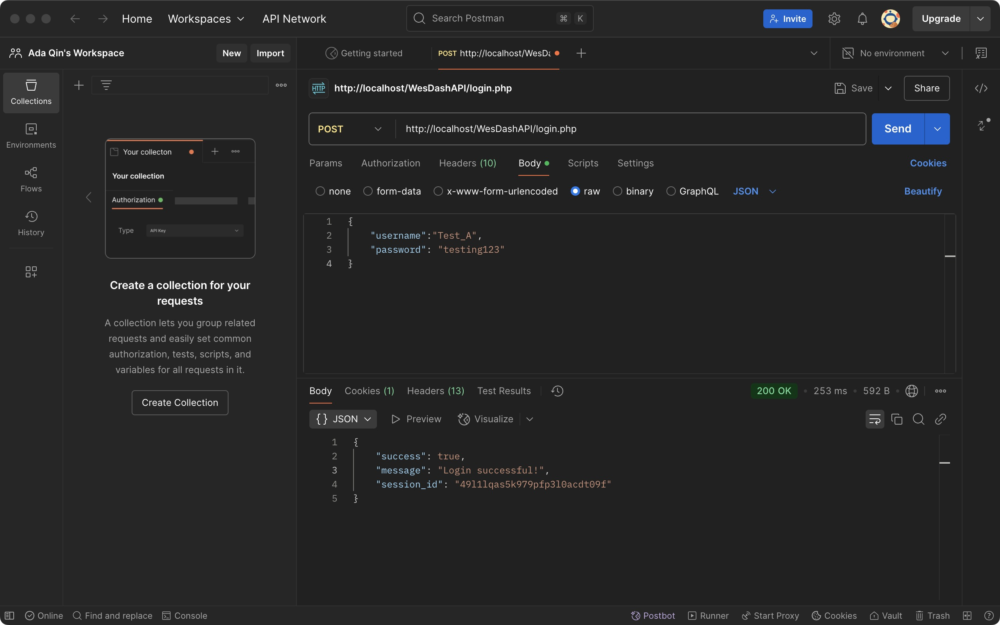

# COMP333
This is for a homework assignment for Wesleyan University, COMP333 Software Engineering.
# Introduction
This is for the first assignment of Wesleyan University, COMP333 Software Engineering.
The website is the landing page of a fictional app: WesDash.

# Teammate and work distribution
Ada Qin: Navigation bar/ Our Strength and Technology/Hyperlink(4)/Style adjustment/Log in 
Haihan Wang: Hero section/ How it works/Style adjustment
Cheruiyot Allan: Customer Reviews/Style adjustment

# Purpose of code
The Code's purpose is to create a landing page for a functional app: WesDash. WesDash is a campus delivery service built for students that is designed to provide fast and easy shopping and delivery services on a university campus. 

# Brief overview
The current repository contains the main page to introduce how WesDash works, including the content of How does app works, the login section, the strength and technology in the app, and the reviews from users, decorated with a hero section, slogan, etc.

The important files are:

index.html: The homepage of the WesDash website. This page contains key features like the navigation bar, hero section, "How It Works", advert slogans, signup form, and customer reviews.

contract.html: A page displaying the contract and terms of service for users of WesDash, including the responsibilities of Buyers, Shoppers, and all Users.

Price_list.html: A page displaying the charging of using the app, including the detailed price and description of different service

styles.css: The main stylesheet used for styling both the main page and contract page, containing a responsive design, color scheme, and layout definitions.

# How to run code

## Locally:
1. Do the following things in the terminal:
   1. `git clone https://github.com/AdaTsanQin/COMP333.git`
   2. `cd COMP333`
2. Do the following things outside of the terminal:
   3. Open the `COMP333` folder and click `index.html` to see the page.

## In the browser:
1. Put this URL in your browser: [https://adatsanqin.github.io/COMP333/](https://adatsanqin.github.io/COMP333/)

# Notification by Ada Qin
Mistakes and actions made while using Github:
1. merge styles.css, login.html, and login_confirm.html into the main branch without a pull request.
2. Part of feature/issue-27 has been changed under HaihanWang's account. The command d50efda bbdead5 d5e961d 74f5128 58f95ee bb2a1a8 is changed by Ada Qin under account 2274006014
3. Because Python as the language was selected when the repo was created at the beginning, redundant files appeared. A line ".ds_store "was added to.gitignore and manually deleted. DS_Store file


## Screenshot of Allan's Xampp


## how to run Allan's user review files - create_review.php, update_review.php delete_review.php
1. Change line 80 in dashboard.html from 
`<a href="update.php">Update Order</a>` to 
`<a href="update_task.php">Update Order</a>`

2. Now run the following SQL queries: `
CREATE TABLE tasks(task_id INT(11) NOT NULL AUTO_INCREMENT,request_id INT(11) DEFAULT NULL,username VARCHAR(255) DEFAULT ' ',dashername VARCHAR(255) DEFAULT ' ',item TEXT,status VARCHAR(50) DEFAULT ' ', rating INT(11) DEFAULT 0,comment TEXT DEFAULT ' ', PRIMARY KEY (task_id) );
`
3. Make a purchase request from the dashboard
4. Go to the dashboard and click "Claim order"
5. In the same dashboard, click "Drop off"
6. Now click "Manage reviews" tab on the top of the dashboard page
7. You should be able to see the order and Add, Update and Delete buttons. These add, update and delete reviews to orders that have been completed

NOTE: The order must have a 'complete' status before adding a review. For this to happen, you must use 'Drop Off' button from the Dashboard.


## Assignment-2
People who register the program can log in and out of the program repeatedly.
As a Buyer, the user can request someone to run errands for him: create a new order, fill in the detailed product name and address in the order, and always check whether someone has accepted the order and whether it has been delivered. There will be a prompt when the order is delivered. After confirming the items, the Buyer ends the order.
At the same time, as a Runner, you can also view the currently accepted orders, accept the orders, and send them to the Buyer at a certain time.
# Work distrubution
Ada: register/ request of Buyer / request of Runner / Readme / deployment in infinityfree
Haihan: login.php, create.php, read.php, updata.php(some part)
Allan: create,update,delete reviews/ Dashboard page
# How to set up app
1. in local MySQL, create a database called app-db
2. Do following in this URL 
http://localhost/phpmyadmin/index.php
Click on database in navigation bar
Under create database enter app-db in the "Database name"
click to get into app-db
go to SQL in navigationbar, copy the following code into it and click go:

CREATE TABLE users (
    username VARCHAR(255) NOT NULL,
    password VARCHAR(255) DEFAULT NULL,
    is_deleted TINYINT(1) DEFAULT 0,
    PRIMARY KEY (username)
);

CREATE TABLE requests (
    id INT AUTO_INCREMENT PRIMARY KEY,
    username VARCHAR(255) NOT NULL,
    item VARCHAR(255) NOT NULL,
    drop_off_location VARCHAR(255) NOT NULL,
    delivery_speed ENUM('urgent', 'common') DEFAULT 'common',
    status ENUM('pending', 'accepted', 'completed', 'confirmed') NOT NULL DEFAULT 'pending',
    created_at DATETIME NOT NULL,
    accepted_by VARCHAR(255) DEFAULT NULL,

    CONSTRAINT fk_requests_username
      FOREIGN KEY (username)
      REFERENCES users(username)
      ON UPDATE CASCADE
      ON DELETE RESTRICT
);

4. Go to the URL : http://localhost/register.php 
then test the code

# URL(infinityfree)
ada-qin.ct.ws not done but tried to set up the SSL
Having following :
Installed SSL Status
This is the SSL certificate that's installed on your hosting account.

Status	
Issuer	Google Trust Services
Expires at	2025-06-05


# local enviornment
1.Ada:


# screenshot
Haihan Wang: 


# HOMEWORK 3

## Overview
This repository contains both a React Native frontend (for iOS/Android) and a PHP/MySQL backend. The app supports:
Account Management: Create user accounts, log in, log out, delete accounts/Requests Management (CRUD): Create, read, edit (update), and delete requests/ Order Flow: Accept order, drop off order, and confirm status changes

We have also partially tested deployment via InfinityFree hosting (see InfinityFree below). The following sections explain how to set up the project locally, how the database is structured, and how to run the code.

## Project structure
WesDash/ <br>
├── .expo/ <br>
├── .idea/ <br>
├── assets/  <br>
├── node_modules/ <br>
├── screen/ <br>
│&nbsp;&nbsp;&nbsp;&nbsp;&nbsp;&nbsp;&nbsp;&nbsp;&nbsp;&nbsp;&nbsp;&nbsp;&nbsp;├── AcceptOrderScreen.js <br>
│&nbsp;&nbsp;&nbsp;&nbsp;&nbsp;&nbsp;&nbsp;&nbsp;&nbsp;&nbsp;&nbsp;&nbsp;&nbsp;├── CreateRequestScreen.js <br>
│&nbsp;&nbsp;&nbsp;&nbsp;&nbsp;&nbsp;&nbsp;&nbsp;&nbsp;&nbsp;&nbsp;&nbsp;&nbsp;├── DashboardScreen.js <br>
│&nbsp;&nbsp;&nbsp;&nbsp;&nbsp;&nbsp;&nbsp;&nbsp;&nbsp;&nbsp;&nbsp;&nbsp;&nbsp;├── HomeScreen.js <br>
│&nbsp;&nbsp;&nbsp;&nbsp;&nbsp;&nbsp;&nbsp;&nbsp;&nbsp;&nbsp;&nbsp;&nbsp;&nbsp;├── LoginScreen.js <br>
│&nbsp;&nbsp;&nbsp;&nbsp;&nbsp;&nbsp;&nbsp;&nbsp;&nbsp;&nbsp;&nbsp;&nbsp;&nbsp;├── RegisterScreen.js <br>
│&nbsp;&nbsp;&nbsp;&nbsp;&nbsp;&nbsp;&nbsp;&nbsp;&nbsp;&nbsp;&nbsp;&nbsp;&nbsp;├── ViewRequestScreen.js <br>
├── App.js <br>
├── package.json <br>
.<br>
.<br>
.<br>
Note: the project run by opening the main branch file in Android Studio

Applications/XAMPP/xamppfiles/htdocs/ <br>
├── WesDashAPI/ <br>
│&nbsp;&nbsp;&nbsp;&nbsp;&nbsp;&nbsp;&nbsp;&nbsp;&nbsp;&nbsp;&nbsp;&nbsp;&nbsp;├── accpte_order.php  <br>
│&nbsp;&nbsp;&nbsp;&nbsp;&nbsp;&nbsp;&nbsp;&nbsp;&nbsp;&nbsp;&nbsp;&nbsp;&nbsp;├── accpte_requests.php <br>
│&nbsp;&nbsp;&nbsp;&nbsp;&nbsp;&nbsp;&nbsp;&nbsp;&nbsp;&nbsp;&nbsp;&nbsp;&nbsp;├── create_requests.php <br>
│&nbsp;&nbsp;&nbsp;&nbsp;&nbsp;&nbsp;&nbsp;&nbsp;&nbsp;&nbsp;&nbsp;&nbsp;&nbsp;├── edit.php <br>
│&nbsp;&nbsp;&nbsp;&nbsp;&nbsp;&nbsp;&nbsp;&nbsp;&nbsp;&nbsp;&nbsp;&nbsp;&nbsp;├── login.php <br>
│&nbsp;&nbsp;&nbsp;&nbsp;&nbsp;&nbsp;&nbsp;&nbsp;&nbsp;&nbsp;&nbsp;&nbsp;&nbsp;├── register.php <br>
│&nbsp;&nbsp;&nbsp;&nbsp;&nbsp;&nbsp;&nbsp;&nbsp;&nbsp;&nbsp;&nbsp;&nbsp;&nbsp;├── delete_user.php <br>

Note: downlaod all the files in main that are in WesDashAPI, create a WesDashAPI under htcods folder, and put all the files downloaded from WesDashPAI folder in main.

## How to Set Up the App
A. Database & PHP (Backend)
1. Start MySQL (XAMPP, MAMP, etc.).
2. Open http://localhost/phpmyadmin/
3. Create a database, e.g., app-db.
Run the following SQL：
CREATE TABLE users (
    username VARCHAR(255) NOT NULL,
    password VARCHAR(255) DEFAULT NULL,
    is_deleted TINYINT(1) DEFAULT 0,
    PRIMARY KEY (username)
);

CREATE TABLE requests (
    id INT AUTO_INCREMENT PRIMARY KEY,
    username VARCHAR(255) NOT NULL,
    item VARCHAR(255) NOT NULL,
    drop_off_location VARCHAR(255) NOT NULL,
    delivery_speed ENUM('urgent', 'common') DEFAULT 'common',
    status ENUM('pending', 'accepted', 'completed', 'confirmed') NOT NULL DEFAULT 'pending',
    created_at DATETIME NOT NULL,
    accepted_by VARCHAR(255) DEFAULT NULL,

    CONSTRAINT fk_requests_username
      FOREIGN KEY (username)
      REFERENCES users(username)
      ON UPDATE CASCADE
      ON DELETE RESTRICT
);

B.Frontend / React Native

1. Install dependencies:

cd react-native-frontend
npm install

2. If using Expo, run:

npx expo start

Note: if 'npx expo start' still not working, then enter the next command 'a' and click return

Or if React Native CLI:

npx react-native start

3. IP addresses: In your JS files, you may see fetch("http://10.0.2.2/..."). This is necessary for Android emulators to reach your local PHP server. If you run on a real device, you must replace 10.0.2.2 with your LAN IP.

4. if you encountered any issue by using command line above, please first run:
'rm -rf node_modules package-lock.json'
then 'start with npx expo start'

## Running the APP
1.Start Apache & MySQL (XAMPP).

2.Start React Native server (Expo or CLI).

3.Launch your Android emulator (Pixel 6A, API 34) or plug in a physical device with USB debugging enabled.

4.In your emulator, run the app. Confirm the requests are reaching your local PHP server.

**Example flows:**

1. **Register** an account (`register.php`) 
2. **Login** (`login.php`), which sets a session cookie
3. **Create** a request from the React Native UI
4. **Edit** (PUT to `edit.php`)
5. **Accept** an order (PUT to your accept endpoint)
6. **Drop off** the order (status changed to completed)
7. **Delete** a request or account

## CRUD 
1. **Create** by clicking "Create Request" button in DashboardScreen 
2. **Read** by clicking "View Request" button in DashboardScreen
3. **Update** by clicking "View Request" button in DashboardScreen, change the context of order,and hit "Confirm Edit" button to update requests, and the order with status 'completed' could be change to 'confirmed' by clicking "Confirm Order". by clicking "Accept Order" button in DashboardScreen, then click "Accept", "Drop off" to change the status of request
4. **Delete** by clicking "View Request" button in DashboardScreen

## REST API Documentation

### 1. `register.php`
- **Method**: `POST`
- **Body** (JSON):
  ```json
  {
    "username": "...",
    "password": "..."
  }
  {
  "success": true,
  "message": "...",
  "session_id": "..."
}

### 2. `login.php`
- **Method**: `POST`
- **Body** (JSON):
  ```json
  {
    "username": "...",
    "password": "..."
  }
  {
  "success": true,
  "session_id": "..."
}

### 3. `create_requests.php
- **Method**: `POST`
- **Body** (JSON):
  ```json
  {
  "item": "...",
  "drop_off_location": "...",
  "delivery_speed": "urgent/common"
   }
   {
  "success": true,
  "message": "Request created"
 }

### 4. `edit.php'
- **Method**: `PUT`
- **Body** (JSON):
  ```json
   {
  "id": 123,
  "item": "...",
  "drop_off_location": "...",
  "delivery_speed": "...",
  "status": "..."
   }
  {
  "success": true,
  "message": "..."
      }

### 5. `accept_order.php'
- **Method**: `PUT``GET`
- **Body** (JSON):
Method: GET ：Returns a list of pending or accepted orders  

PUT body { "id": 123 } -> sets status to 'accepted'  
PUT body { "id": 123, "action": "drop_off" } -> sets status to 'completed'

### 6. `delete_user.php‘
- **Method**: `POST’：Removes or marks the user as deleted
- **Body** (JSON):
  ```json
  {
  "username": "...",
  "password": "..."
   }


## Postman Screenshots：
HaihanWang：


Ada:



Allan:


## Work distribution：
1. Haihan Wang：accpept_order,dropoff_order,fix error, ReadMe
2. Ada: Register,login,delete_account,edit,viewrequest, ReadMe
3. Allan:review,fix error
